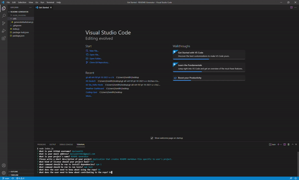

# README Generator
  
      https://opensource.org/licenses/MIT

  ## Description

  This application that creates README markdown file specific to user's project utilizing  Nodejs and Inquirer to gather user's information about the project installation,
  usage, license used, contribution and run test information, and where to reach user for additional questions. 

  ## Table of Contents

  * [Installation](#installation)

  * [Usage](#usage)

  * [License](#License)

  * [Contributing](#contributing)

  * [Tests](#tests)

  * [Questions](#Questions)

  ## Installation
  
  To install necessary dependencies run the following command:

  ```
  npm i
  ```

  ## Usage

  The following animation demonstrates the application functionality:

  


  ## License

  This project is licensed under the MIT license.

  ## Contributing

  NA

  ## Tests

  To run tests, run the following command:

  ```
  npm test
  ```

  ## Questions

  If you have any questions about the repo, open an issue or contact me directly at dasiasmith023@gmail.com. You can find more of my work
  at https://github.com/dasiasmith .

